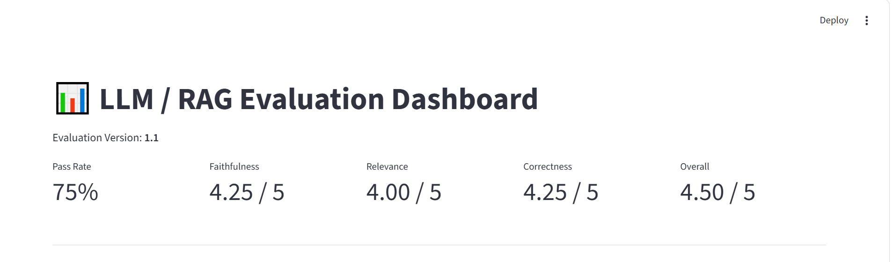
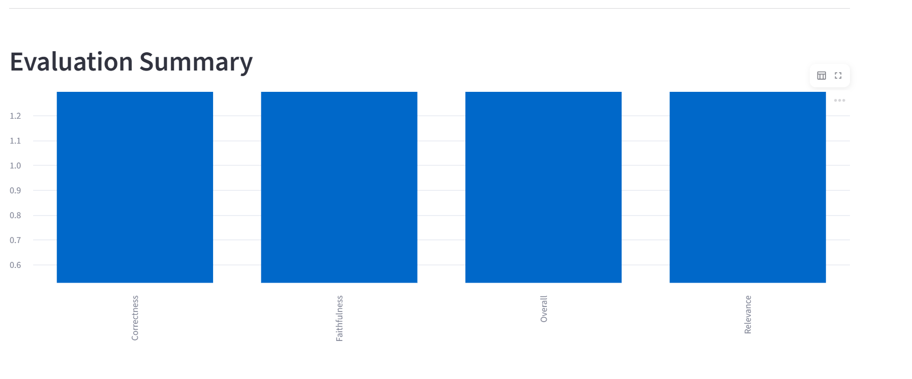
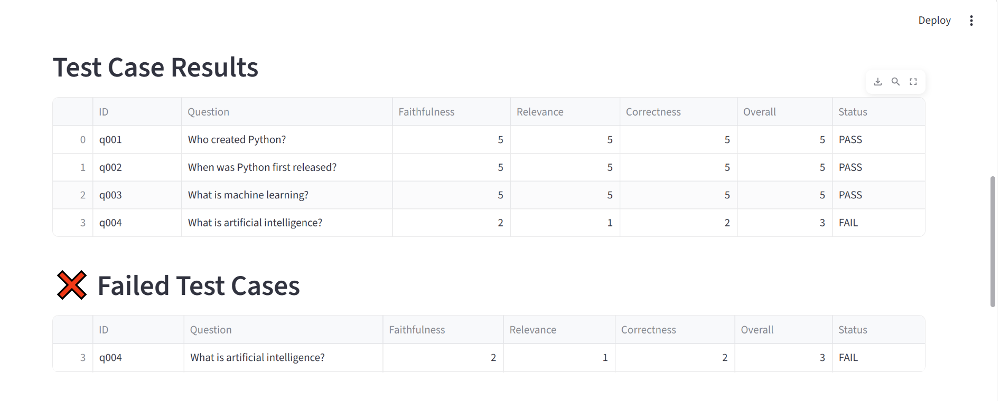
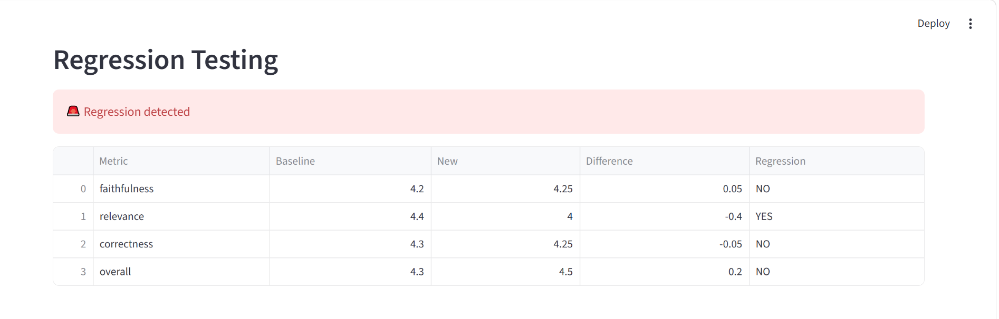
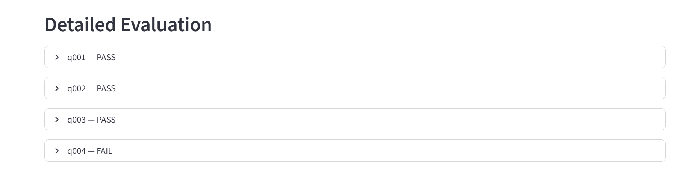

# 25-Day Learning Plan for Evaluations

This learning plan covers 25 days of practical evaluation work for LLM and RAG systems, with Days 1 to 15 marked as completed.

## Day 1 – Introduction to LLM evaluation
Learn what evaluation means for generative AI and why measuring quality is important before deployment.

```bash
python --version
pip install streamlit pandas
```

## Day 2 – Understand evaluation types
Study offline, online, human, model-based, and retrieval-based evaluation methods.

```bash
python -c "print('Offline and online evaluation concepts learned')"
```

## Day 3 – Set up the project structure
Create folders, datasets, scripts, and results storage for evaluation workflows.

```bash
mkdir data results app
```

## Day 4 – Data preparation for evaluation
Prepare benchmark datasets, golden answers, and expected outputs for testing.

```bash
python -c "import json; print('Dataset ready')"
```

## Day 5 – Retrieval evaluation basics
Understand how document retrieval quality affects downstream generation quality.

```bash
python -c "print('Retrieval metrics: precision, recall, MRR')"
```

## Day 6 – Generation evaluation basics
Evaluate generated answers using correctness, relevance, and factual consistency.

```bash
python run_evaluation.py
```

## Day 7 – Metrics for QA evaluation
Explore exact match, accuracy, precision, recall, and F1 for answer comparison.

```bash
python test_metrics.py
```

## Day 8 – LLM-as-a-judge introduction
Use an LLM to judge answer quality rather than relying only on rule-based metrics.

```bash
python evaluate_with_judge.py
```

## Day 9 – Judge prompt design
Design scoring prompts for faithfulness, relevance, correctness, and overall quality.

```bash
python -c "print('Prompt engineering for evaluation')"
```

## Day 10 – Score schema design
Define metric structures such as nested scores with reason fields and numeric overall scores.

```bash
python -c "import json; print(json.dumps({'faithfulness': {'score': 5, 'reason': 'good'}}))"
```

## Day 11 – Threshold-based pass/fail logic
Set rules like minimum score for pass/fail and compare numeric values against thresholds.

```bash
pytest -q test_thresholds.py
```

## Day 12 – Build evaluation runner
Create a pipeline to run datasets through retriever, generator, judge, and threshold checks.

```bash
python run_evaluation.py
```

## Day 13 – Save evaluation results
Serialize results into JSON for tracking metrics, questions, outputs, and status.

```bash
python -c "import json; json.dump({'status': 'saved'}, open('results/sample.json', 'w'))"
```

## Day 14 – Regression testing
Compare current evaluation results with a baseline to detect performance regressions.

```bash
python -c "print('compare_versions() baseline vs current')"
```

## Day 15 – Dashboard creation
Visualize evaluation summary and per-case score breakdown using Streamlit.

```bash
streamlit run dashboard.py
```

## Completed So Far
Days 1 to 15 have been completed successfully, covering the fundamentals of evaluation setup, metrics, judging, threshold logic, results storage, regression comparison, and dashboard visualization.

## Remaining Plan (Days 16–25)

## Day 16 – Advanced retrieval metrics
Measure recall@k, nDCG, MRR, and retrieval quality with deeper analysis.

```bash
python evaluate_retrieval.py
```

## Day 17 – Robustness testing
Evaluate model behavior under ambiguous, noisy, and adversarial prompts.

```bash
python -c "print('Run edge-case evaluation dataset')"
```

## Day 18 – Bias and fairness checks
Assess whether answers are consistent, balanced, and free from sensitive bias.

```bash
python -c "print('Bias and fairness review checklist')"
```

## Day 19 – Hallucination detection
Measure unsupported claims and factual mismatch in generated outputs.

```bash
python -c "print('Check unsupported claims in answers')"
```

## Day 20 – Calibration and confidence analysis
Study whether confidence scores align with actual answer correctness.

```bash
python -c "print('Confidence calibration analysis')"
```

## Day 21 – A/B testing for model comparisons
Compare different model versions or prompts using statistical evaluation methods.

```bash
python -c "print('Run A/B evaluation comparison')"
```

## Day 22 – Multi-metric score aggregation
Combine multiple quality dimensions into a single composite evaluation score.

```bash
python -c "print('Aggregate faithfulness + relevance + correctness')"
```

## Day 23 – Production evaluation pipeline
Create a repeatable CLI workflow for running evaluations on new datasets automatically.

```bash
python run_evaluation.py
```

## Day 24 – Final report writing
Summarize findings, identify weaknesses, and document model quality conclusions.

```bash
python -c "print('Generate final evaluation report')"
```

## Day 25 – Review and improvement roadmap
Identify the next optimization steps for prompts, retrieval, judge design, and metrics.

```bash
python -c "print('Plan next iteration of improvements')"
```

## Quick Commands Summary

```bash
python run_evaluation.py
streamlit run dashboard.py
pytest -q
python evaluate_with_judge.py
python evaluate_retrieval.py
```

## Goal
The final goal is to build a reliable, repeatable evaluation workflow for LLM and RAG systems that can measure quality, detect regressions, and support continuous improvement.


Most Important Interview Architecture

If the interviewer asks:

"Explain your LLM evaluation project."

                     DOCUMENTS
                         │
                         ▼
                    EMBEDDINGS
                         │
                         ▼
                   VECTOR STORE
                         │
                         ▼
                     RETRIEVER
                         │
                         ▼
                      CONTEXT
                         │
                         ▼
                    Llama 3.2
                         │
                         ▼
                     ANSWER
                         │
                         ▼
                   LLM JUDGE
                         │
             ┌───────────┼───────────┐
             ▼           ▼           ▼
       Faithfulness  Relevance  Correctness
             │           │           │
             └───────────┼───────────┘
                         ▼
                     THRESHOLD
                         │
                    PASS / FAIL
                         │
                         ▼
                    REGRESSION
                         │
                         ▼
                   JSON RESULTS
                         │
                         ▼
                 STREAMLIT DASHBOARD


    







